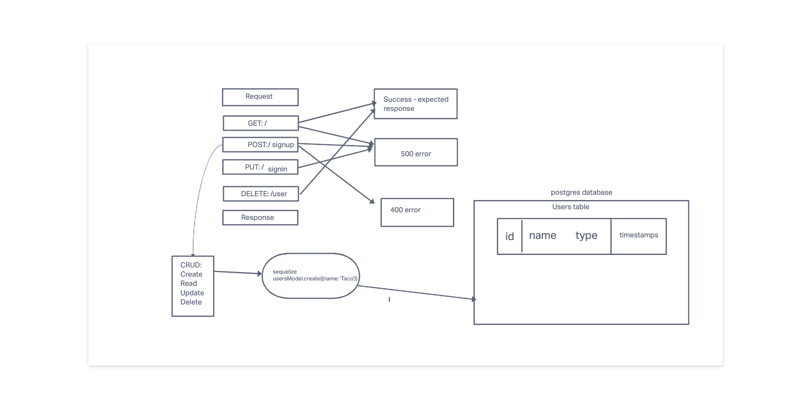

# basic-auth

## Author: Adrienne Frey
### Problem Domain
 modularization of provided code

### Links and Resources
GitHub Actions 
Prod back-end server url

### Setup
.env requirements (where applicable)
DATABASE_URL=postgres://localhost:5432/basic-auth

## How to initialize/run your application (where applicable)
e.g. npm start

## How to use your library (where applicable)

## Features / Routes

### TESTS

How do you run tests? npm test
Any tests of note? No
Describe any tests that you did not complete, skipped, etc N/A

## UML

## Collaborators

Jordan Covington 
Joe Davitt
Rafael Aldana
Ken Holt